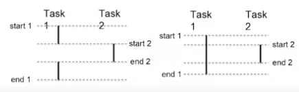

# Concurrent Execution

- concurrent execution is not necessarily the same as parallel execution
- *Concurrent*: start and end times overlap
- *Parallel*: execute at exactly the same time

Concurrency vs Parallelism

